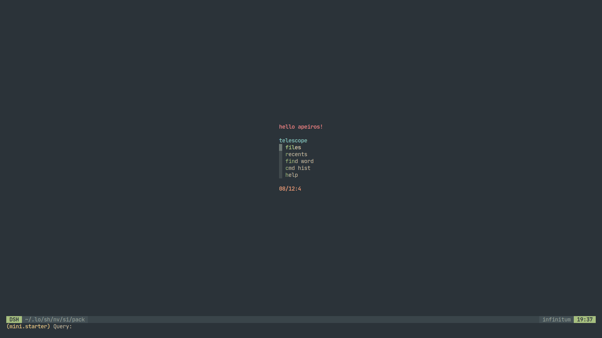

# My Neovim configuration

My Neovim configuration, originally based on Theory's [nii-nvim](https://github.com/Theory-of-Everything/nii-nvim)

## Requirements

Only tested on Neovim v0.8.1

- fzf
- git
- ripgrep
- python-pynvim
- a Nerd Font in your terminal

## Installation

1. `cd ~/.config`
2. `git clone https://github.com/Apeiros-46B/nvim`
3. Start `nvim` once (ignore the errors) and wait for the plugin downloading to finish
4. Start `nvim` again. The config should be successfully installed this time

## Screenshots

